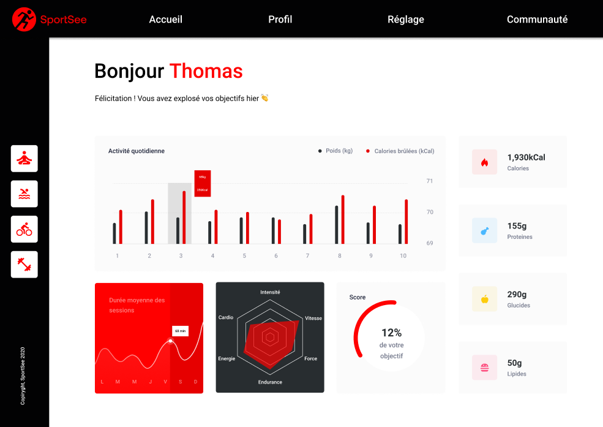

<p align="center">
  
  
</p>

# SportSee 🏋️ 📊
SportSee is a modern application built with React & Vite. It allows users to visualize and track their sports performance through an interactive dashboard.

---

<div align="center">

  <!-- Languages / Formats -->
  
  
  
  

  <br/>

  <!-- Frameworks / Library -->
  
  
  
  
  
  

  <br/>

  <!-- Outils / Build -->
  
  

  <br/>

  <!-- Repo + License -->
  <a href="https://github.com/Tigershark936/SportSee_Developpez_un_tableau_de_bord_d-analytics_avec_React">
    
  </a>
  <a href="https://github.com/Tigershark936/SportSee_Developpez_un_tableau_de_bord_d-analytics_avec_React/blob/main/LICENSE">
    
  </a>

</div>

<br/>

<div align="center">
    <!-- Maquette -->
    
</div>

<br>

<div align="center">
<a href="https://sportsee-tsk.netlify.app/">
  🌐 SportSee Démo 🌐
</a>
</div>

---

## 🎯 Project objectives
- Display a **dashboard** for each user grouping different charts :
  - Daily activity (barchart)
  - Average session duration (linechart)
  - Performance Radar (radarchart)
  - Score / goal (radialbarchart)
  - Nutrient cards (kCal, proteins, carbohydrates, lipids)
- Clean architecture, reusable components, modular SCSS styles.
- **Real API** data source *or* **local mock** (automatic fallback).

---

## 🧩 Stack & Principes
- **React + Vite** (SPA)
- **React Router** (navigation)
- **Recharts** (charts)
- **Sass/SCSS** (modular styles)
- **PropTypes** (typage runtime)
- **ESLint** (quality)

---

## 🚀 Installation & Launch

### Frontend (React + Vite)
```bash
# clone the repository
git clone https://github.com/Tigershark936/SportSee_Developpez_un_tableau_de_bord_d-analytics_avec_React.git
cd daly-alain-react

# install dependencies
npm install

# start the project
npm run dev

👉 Frontend available at: http://localhost:5173
``` 

---

## 🔗 Backend (Micro API SportSee)

The project includes an official backend in the form of a micro API.  
Source code : [SportSee Back-End](https://github.com/OpenClassrooms-Student-Center/P9-front-end-dashboard)

### 1) Prérequis backend

- NodeJS version ≥ 12.18 (tested up to 20.x) 
- Yarn (package manager) 
- (Optional) nvm if you manage multiple Node versions 

👉 Install Yarn if needed:
```bash
npm install --global yarn
```

⚠️ Verify the installation:
```bash
yarn -v
```

### 2) Launch the backend


#### Clone the repo at the root of your project  
(the backend must be placed at the same level as the React folder,
and not inside `daly-alain-react` ).

```bash
Example folder structure:
mon-projet/
├── daly-alain-react          # frontend
└── backend                   # backend
```
```bash
git clone https://github.com/OpenClassrooms-Student-Center/P9-front-end-dashboard.git
cd backend

# install dependencies
yarn install

# start the server
yarn dev

👉 Backend available at: http://localhost:3000
```
---

## 🔗 Backend Endpoints

The backend exposes **4 main endpoints** available at `http://localhost:3000`:

### 1) List of endpoints
- `GET /user/:id`  
  → Retrieves user information (id, first name, last name, age, todayScore, and keyData: calories, macronutrients, etc.)

- `GET /user/:id/activity`  
  → Retrieves the user's daily activity (weight in kg and calories burned)

- `GET /user/:id/average-sessions`  
  → Retrieves the user's average session length per day (the week starts on Monday)

- `GET /user/:id/performance`  
  → Retrieves the user's performance (cardio, energy, endurance, strength, etc.)

⚠️ **Important**: the official backend only provides **2 mocked users** → `id=12` and `id=18`.

---

### 2) Example queries
- [http://localhost:3000/user/18](http://localhost:3000/user/18)  
  → Main information of the user with ID 18  

- [http://localhost:3000/user/12/performance](http://localhost:3000/user/12/performance)  
  → Performance data of the user with ID 12  

ℹ️ For these links to work, you must run the backend with `yarn dev` on port 3000.  
👉 This requires opening **2 terminals simultaneously** in your IDE:  
- one for the **frontend** (`npm run dev`, port 5173)  
- one for the **backend** (`yarn dev`, port 3000)  

---

## 🛡️ Project Resilience (Fallback Mock)

The SportSee frontend can run in **two different data modes**:

1. **API mode** (`VITE_DATA_SOURCE=api`)  
   → Data is retrieved from the backend (`http://localhost:3000`).

2. **Mock mode** (`VITE_DATA_SOURCE=mock`)  
   → Local JSON data embedded directly in the project.

🔑 **Key advantage**:  
Even if the backend is unavailable (*down*), the application **remains fully functional** thanks to the mock system.  

👉 In my implementation, I also added an **extra mock user** with `id=55`, available **only on the frontend side**.  
- This mock is **not accessible via the backend API**.  
- It demonstrates the dashboard behavior and makes testing possible even without a running backend.  
- This highlights the robustness of the **fallback mock strategy** I implemented.

---

## 📊 Charts & Key Components

- **ActivityChart** – BarChart showing weight (kg) & calories burned  
- **SessionsChart** – LineChart for average session duration + custom cursor  
- **PerformanceRadar** – RadarChart (with localized labels)  
- **ScoreRadial** – RadialBarChart showing the daily goal achievement  
- **NutrientCard** – Cards displaying kCal / Proteins / Carbohydrates / Lipids 

---

## 🗂️ Project Structure

```bash
daly-alain-react/
├── public/ # Static public assets
├── src/
│ ├── assets/ # Images, logos, icons
│ ├── components/ # Reusable UI components
│ ├── hooks/ # Custom React hooks
│ ├── mock/ # Local JSON mock data
│ ├── pages/ # Main pages (Dashboard, Home, etc.)
│ ├── sass/ # SCSS styles (global & modules)
│ ├── App.jsx # Root component
│ ├── main.jsx # React entry point
│ └── main.scss # Main SCSS entry point
├── .gitignore
├── eslint.config.js # ESLint configuration
├── index.html # HTML template
├── LICENSE
├── MaquetteSportSee.png # UI mockup image
├── netlify.toml # Netlify deployment config
├── package.json
├── package-lock.json
├── README.md
└── vite.config.js # Vite configuration
```

---

## 🔒 License

This project is licensed under the MIT License – see [LICENSE](./LICENSE) for details.

---

## 👤 Author

**Alain**  
Repo: [https://github.com/Tigershark936/SportSee_Developpez_un_tableau_de_bord_d-analytics_avec_React](https://github.com/Tigershark936/SportSee_Developpez_un_tableau_de_bord_d-analytics_avec_React)
